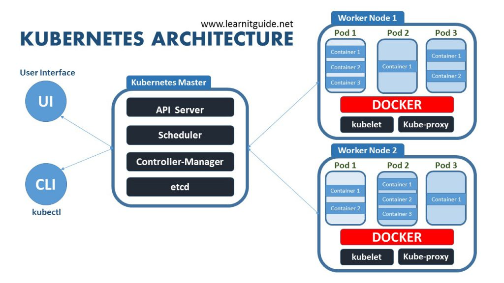

# Kubernetes

## What is kubernates
Kubernetes is an open-source container managment platform that automates the deployment, scaling, and management of containerized applications. It was originally developed by Google and is now maintained by the Cloud Native Computing Foundation (CNCF).

## Why kubernates is used:
When you run applications in containers (like Docker), managing them manually can be complex. Kubernetes makes it easier by:
- Automatically managing container lifecycles
- Scaling applications up or down based on demand
- Load balancing traffic between multiple containers
- Self-healing by restarting failed containers
- Rolling updates without downtime

## Cluster
A Kubernetes cluster is a group of machines (nodes) that work together to run and manage containerized applications efficiently. It consists of a Control Plane (Master Node) and multiple Worker Nodes that execute the applications.

## Kubernates architecture

### Explanation:
A Kubernetes architecture consists of a Control Plane (Master Node) and Worker Nodes that manage and run containerized
applications
### 1. Control pannel: 
The Control Plane is responsible for managing the Kubernetes cluster. It makes decisions about scheduling, scaling, and maintaining the system state.
#### Key components of control pannel
1. API Server
- The main entry point for all Kubernetes commands (kubectl, API calls).
- It validates and processes requests.
2. Controller Manager
  - Ensures the cluster is in the desired state
3. Scheduler
- Assigns Pods to Worker Nodes based on resource availability
4. etcd
- stores key-value type data
- A distributed database that stores cluster state and configuration.
- Every change in the cluster is recorded in etcd.
### 2. Worker Nodes
Worker Nodes run the actual applications in the form of Pods (smallest deployable units in Kubernetes
#### Key components of Worker Nodes:
1. Kubelet
- Runs on every Worker Node
- Communicates with the Control Plane and ensures that Pods are running.
3. Kube Proxy
- Handles networking and ensures that Pods can communicate with each other.
4. Container Runtime
- The software responsible for running containers

## What is Pod
A Pod is the smallest and most basic deployable unit in Kubernetes. It represents a single instance of a running process in your cluster.A Pod can run a single container (most common) or multiple tightly coupled containers that share resources.

## Container Runtime Engine
A Container Runtime Engine (CRE) is essential for running Pods in Kubernetes. It is responsible for managing containerized applications inside a Pod, ensuring they start, stop, and function correctly.
### How a Container Runtime Works in a Pod:
- Pulls the container image from a registry when a Pod is scheduled.
- Creates and runs containers inside the Pod.
- Handles resource isolation to ensure Pods get their allocated CPU, memory, and storage.
- Manages networking for communication between Pods.
- Interacts with Kubernetes through the Container Runtime Interface (CRI) to maintain the Pod lifecycle.

## kubernates Object
Kubernetes objects define and manage the state of your cluster, controlling how applications run, how they communicate, and how they store data. 
### 1. Workload Objects
### 1.1 Pod
- A Pod is the smallest deployable unit in Kubernetes, representing one or more containers that share network and storage. It ensures that all containers in the Pod run together and can easily communicate with each other.
- Use case: Running a single instance of an application or grouping related containers together (e.g., an app container and a sidecar for logging).
### 1.2 Deployment
- A Deployment manages multiple identical Pods to ensure application availability and scalability. It supports rolling updates and rollbacks, making it ideal for stateless applications.
- Running web applications, API servers, or microservices that need high availability and auto-scaling.
### 1.3 StatefulSet
- A StatefulSet is used for applications that require stable network identities and persistent storage, such as databases. Each Pod in a StatefulSet has a unique name and maintains order during deployment and scaling.
- Use case: Running stateful applications like MySQL, MongoDB, or Kafka that require stable disk storage and ordered scaling.
### 1.4 DaemonSet
- A DaemonSet ensures that a specific Pod runs on every node in the cluster. It is commonly used for background processes that need to run everywhere.
- Use case: Running system-wide services such as monitoring agents (e.g., Prometheus, Fluentd) or network proxies on every Kubernetes node.
### 1.5 Job & CronJob
- A Job runs a task to completion, making it useful for batch processing.
- A CronJob schedules jobs to run at specified intervals, similar to a Linux cron job.
- Use case: Running one-time tasks (e.g., database backup, image processing) or scheduled tasks (e.g., generating reports every night).
### 2. Networking Objects
### 2.1 Service
- A Service provides a stable IP and DNS name for a set of Pods, allowing them to communicate reliably even when Pods are replaced. Services can expose applications inside or outside the cluster
- use case: Exposing a backend API to a frontend application or making an internal database service available to microservices.
### 2.2 Ingress
- An Ingress manages external access to Services, handling HTTP and HTTPS traffic using domain-based routing. It allows multiple applications to share a single external IP while directing traffic to different Services.
-  Use case: Exposing multiple web applications under different paths (e.g., /app1 and /app2) using a single domain.
### 2.3 NetworkPolicy
- A NetworkPolicy controls how Pods communicate with each other by defining rules for allowed or denied network traffic.
- Use case: Restricting traffic between backend and frontend Pods or ensuring that only authorized microservices can talk to the database.
### 3. Storage Objects
### 3.1 PersistentVolume (PV) and PersistentVolumeClaim (PVC)
- A PersistentVolume (PV) is a storage resource provisioned in the cluster (e.g., cloud storage, NFS, or a local disk).
- A PersistentVolumeClaim (PVC) is a request for storage made by a Pod.
- Use case: Ensuring data persistence for databases, message queues, or applications that store user-generated content.
### 3.2 ConfigMap
- A ConfigMap stores non-sensitive configuration data such as environment variables, command-line arguments, or configuration files. It helps keep application settings separate from the container image.
- Use case: Storing database connection strings, logging levels, or feature flags that need to be dynamically updated
### 3.3 Secret
- A Secret stores sensitive data such as passwords, API keys, and certificates securely. Unlike ConfigMaps, Secrets are stored in an encrypted format.
- Use case: Managing database credentials, cloud API tokens, or TLS certificates securely.
### 4. Cluster Management Objects 
### 4.1 Namespace
- A Namespace creates isolated environments within a Kubernetes cluster, allowing different teams or projects to share the cluster without conflicts.
- Use case: Organizing resources for development, staging, and production environments or separating different teams’ applications.
### 4.2 ResourceQuota
- A ResourceQuota limits the CPU, memory, and storage usage of a Namespace to prevent resource overuse.
- Use case: Ensuring that no single application consumes excessive cluster resources, improving stability.
### 4.3 LimitRange
- A LimitRange sets minimum and maximum resource limits for Pods and containers within a Namespace, ensuring efficient resource allocation.
- Use case: Preventing Pods from consuming too little or too much CPU/memory, ensuring fair resource distribution.

## Requirements for Installing and Using Minikube on an Ubuntu Instance
Operating System: Ubuntu 20.04+ (Recommended)
- Processor: 64-bit CPU
- RAM: At least 2 GB RAM (4 GB+ recommended for better performance)
- Disk Space: At least 20 GB free space
- Virtualization Support: Required for running Minikube with a hypervisor like VirtualBox or KVM
- A container runtime to run Kubernetes: Docker OR Containerd OR CRI-O

### Docker Installtion on Ubuntu machine
``` 
# Add Docker's official GPG key:
sudo apt-get update
sudo apt-get install ca-certificates curl -y
sudo install -m 0755 -d /etc/apt/keyrings
sudo curl -fsSL https://download.docker.com/linux/ubuntu/gpg -o /etc/apt/keyrings/docker.asc
sudo chmod a+r /etc/apt/keyrings/docker.asc

# Add the repository to Apt sources:
echo \
  "deb [arch=$(dpkg --print-architecture) signed-by=/etc/apt/keyrings/docker.asc] https://download.docker.com/linux/ubuntu \
  $(. /etc/os-release && echo "${UBUNTU_CODENAME:-$VERSION_CODENAME}") stable" | \
  sudo tee /etc/apt/sources.list.d/docker.list > /dev/null
sudo apt-get update

#Install the Docker packages, install the latest version, run:
sudo apt-get install docker-ce docker-ce-cli containerd.io docker-buildx-plugin docker-compose-plugin -y
```
### Start and Enable Docker Service
```
sudo systemct start docker

sudo systemctl enable docker
```
### Minikube Installation on ubuntu Machine
```
curl -LO https://github.com/kubernetes/minikube/releases/latest/download/minikube-linux-amd64

sudo install minikube-linux-amd64 /usr/local/bin/minikube && rm minikube-linux-amd64
```

## Kubectl Installation on Ubuntu Machine
```
#update the package list to ensure you get the latest version
sudo apt update && sudo apt upgrade -y

# Install kubectl
sudo apt install -y kubectl

# Install kubectl Using Snap
sudo snap install kubectl --classic

# Verify the installation:
kubectl version --client
```
### Start Minikueb service
```
sudo minikube start --force
```
